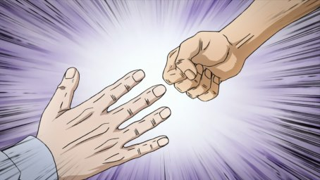

<h1> Rock Paper Scissors - Python text-based version of the universal hand gesture game! </h1>

Pick your weapon and play against the computer - you'll only get a virtual sting if you lose!

### Requirements

All you need is <a href="https://www.python.org/downloads/" rel="nofollow">Python 3</a> to play.

### Usage
Clone the project, <code>cd</code> to your directory/download, and run the main.py file in a Python 3 shell (Terminal on a mac / Linux, Windows command prompt).

### Rules
Same as the classic game:

<li>
	Paper covers Rock
</li>
<li>
	Scissors cuts Paper
</li>
<li>
	Rock smashes Scissors
</li>

Choose your weapon wisely!

Built with <a href="https://www.python.org/doc/" rel="nofollow">Python 3</a>

made with love <3

### License 
Made by: Evan Hansen
LL Cool J 2021
